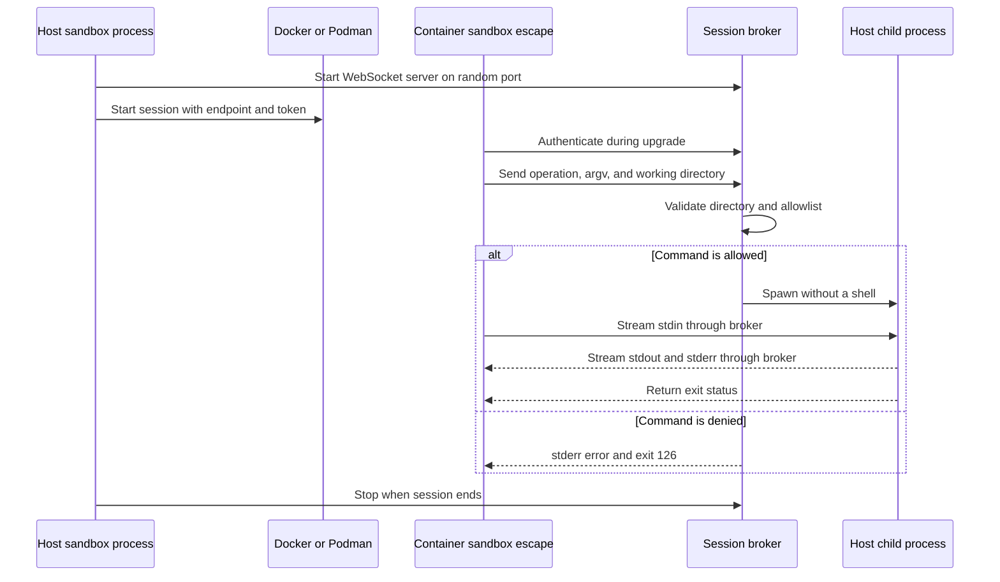

# Controlled Host Command Escape

## Purpose

Sandbox agents cannot use host-only tools. Examples include `open`, Docker, and end-to-end tests that need host services.

Add a controlled escape path:

```bash
sandbox escape -- open report.html
sandbox escape -- bun run test:e2e
```

The command runs on the host. The container command keeps live stdin, stdout, stderr, and exit status behavior. The host enforces an allowlist before it starts a process.

This feature is an explicit exception to the container security boundary. The user controls the exception through trusted configuration.

## Goals

- Let an agent run selected host commands.
- Enforce all permissions in the host process.
- Stream process input and output without buffering the complete result.
- Preserve stdout and stderr as separate streams.
- Return useful and stable exit codes.
- Support Docker and Podman on macOS, Linux, and Windows.
- Reuse the public `sandbox` command inside the container.
- Keep the broker limited to one active Sandbox session.
- Keep the protocol suitable for a possible future daemon.

## Non-Goals

The first version does not provide:

- a permanent host daemon
- pseudo-terminal support
- interactive full-screen host applications
- container environment forwarding
- special parsing for `NAME=value command`
- per-command approval prompts
- deny rules
- host command use after the parent Sandbox session ends

## User Interface

### Execute a host command

Use `--` to separate `escape` options from the host command:

```bash
sandbox escape -- <command> [arguments...]
```

The container client sends the original argument vector to the broker. The broker starts the process directly. It does not use a shell.

The host-side use of `sandbox escape` fails because no active broker is present. The command is for processes inside an active Sandbox session.

### List allowed commands

```bash
sandbox escape --list
```

The command asks the active host broker for its effective allowlist. It does not read a configuration copy in the container.

Print one pattern per line. Do not print a heading:

```text
open *
docker compose *
bun run test:e2e
```

Apply these output rules:

- Use the configuration snapshot from session start.
- Remove duplicate patterns.
- Preserve effective configuration order.
- Print no output for an empty allowlist.
- Return exit code `0` for an empty allowlist.
- Write connection and protocol failures to stderr.
- Return a nonzero exit code when the broker is not available.

## Configuration

Add the accumulating `allow_host_commands` array to the configuration catalog:

```toml
# SECURITY: Each matching command runs on the host with your user permissions.
# Only allow commands and arguments that you trust.
allow_host_commands = [
  "open *",
  "docker compose *",
  "bun run test:e2e",
]
```

The setting is valid in global and project configuration. Global and project entries form a union, like other accumulating arrays.

Project configuration uses the existing content-hash trust flow. A change to `.sandbox/` requires trust again. Do not add a second prompt or runtime warning for host commands. Keep the security warning as a configuration comment.

Reject empty patterns and patterns that contain line breaks. This keeps matching and `--list` output clear.

See [Configuration Cascade](../../../docs/CONFIG-CASCADE.md) for the existing merge and trust behavior.

## Command Matching

Use an allow-only model based on the OpenCode granular permission approach. See [OpenCode Permissions](https://opencode.ai/docs/permissions/).

Apply these rules:

- A pattern without `*` is an exact command and argument match.
- A standalone `*` matches zero or more complete arguments.
- All literal command and argument parts must match exactly.
- Match the original argument vector. Do not match a shell-expanded command.
- Evaluate the effective global and project patterns as a union.
- Permit the command when at least one pattern matches.
- Reject the request before process creation when no pattern matches.

Examples:

```text
Pattern:  bun run test:e2e
Allows:   bun run test:e2e
Rejects:  bun run test
Rejects:  bun run test:e2e --update

Pattern:  open *
Allows:   open
Allows:   open report.html
Allows:   open first.html second.html

Pattern:  docker compose *
Allows:   docker compose
Allows:   docker compose up
Allows:   docker compose run app test
Rejects:  docker run app
```

A pattern is permission syntax, not shell syntax. The implementation must keep argument boundaries during matching. It must not join arguments into an ambiguous string before authorization.

## Runtime Architecture

The existing `/usr/local/bin/sandbox` wrapper runs the package-mounted public CLI. Register `escape` in that public CLI. Keep `sandbox-container-tools` limited to container setup and runtime support.

Use one product component for the complete capability:

```text
apps/sandbox
|-- registers `sandbox escape`
|-- provides WebSocketService
|
+--> sandbox-containers
|      `-- owns HostCommandEscapeSession lifetime
|
`--> host-command-escape
       |-- client
       |-- broker
       |-- command policy
       |-- protocol
       `-- session resource
              |
              +--> platform/websocket
              `--> platform/process
```

The host CLI starts one broker for each active execution session:



The broker runs in the existing host Node.js process. Escaped commands run as separate managed child processes. The host process can wait for `docker exec` and serve WebSocket connections through the Node.js event loop.

The broker stops with the execution session. A reused container does not keep escape access after the host session ends.

### Session connection

Use an authenticated WebSocket connection through the `ws` package:

- Listen on a random host port.
- Connect through `host.docker.internal`.
- Generate a new high-entropy token for each session.
- Inject the endpoint and token only into the container execution session.
- Redact the token from all logs and displayed runtime arguments.
- Authenticate the token during the WebSocket upgrade.
- Reject an invalid token before a WebSocket session starts.
- Use a versioned WebSocket subprotocol.
- Disable WebSocket compression.
- Set a strict maximum message size.
- Keep the listener open only for the active session.
- Permit concurrent client connections.

The container network policy must permit the session broker endpoint. The feature must not relax the existing network policy. The session token and host allowlist remain required even when another container process can reach the port.

Transport authentication identifies the active session. It does not replace command authorization. The broker must check every execute request against its host-side configuration snapshot.

### Protocol operations

Use JSON text messages for control data:

```ts
type ClientControlMessage =
  | { type: "execute"; argv: string[]; cwd: string }
  | { type: "stdin-end" }
  | { type: "signal"; signal: SupportedSignal }
  | { type: "list" }

type BrokerControlMessage =
  | { type: "ready" }
  | { type: "allowed-commands"; patterns: string[] }
  | { type: "exit"; exitCode: number }
  | { type: "error"; code: string; message: string }
```

Use binary WebSocket messages for process streams. Prefix each message with one channel byte:

```text
1 = stdin
2 = stdout
3 = stderr
```

Use one connection for one operation. Close the connection after `list` returns or the executed command completes. Multiple connections provide concurrency.

The client starts stdin forwarding only after the broker sends `ready`. When container stdin reaches end-of-file, send `stdin-end` and keep the connection open for output and exit status.

The WebSocket platform adapter must make binary sends awaitable. Apply backpressure in both directions. Do not buffer unbounded process output. The protocol does not guarantee a total order between stdout and stderr because they are separate operating system streams.

## Process Behavior

### Working directory

The client sends its current container directory. Map it to the corresponding path under the host project root:

```text
Container project root + relative directory
                    |
                    v
Host project root + relative directory
```

Apply these checks before process creation:

1. Resolve the directory relative to the known container project root.
2. Reject path traversal outside that root.
3. Resolve the host path with platform path APIs.
4. Reject a missing host directory.
5. Reject a canonical path outside the host project root, including a symlink escape.

Do not permit arbitrary host working directories.

### Environment

Use the environment of the host `sandbox` process. Do not send the container environment to the broker.

Do not give special meaning to this form in the first version:

```bash
sandbox escape -- MY_VAR=1 command
```

The client treats `MY_VAR=1` as the requested executable. It will normally fail authorization. Explicit environment overrides can be a later feature with their own authorization rules.

### Streams and terminal behavior

Use operating system pipes, not a pseudo-terminal:

```text
Container stdin  -------> Host child stdin
Container stdout <------- Host child stdout
Container stderr <------- Host child stderr
```

Forward each chunk when it becomes available. Keep stdout and stderr separate. A host command can detect that its streams are not terminals. It can disable colors, progress animation, or terminal-only interaction.

The client reads container stdin as an asynchronous byte stream. It waits for each binary WebSocket send. The broker waits for each `ProcessInput.write()`. The broker reads child stdout and stderr from separate asynchronous iterators and waits for each WebSocket send. This carries backpressure across the complete path.

Forward supported termination signals. If the client disconnects, terminate its host child process. When the Sandbox session ends, terminate all host child processes before the broker closes.

### Exit behavior

Use these exit rules:

- Return the child exit code unchanged after normal process completion.
- Return `126` when configuration or working-directory policy denies execution.
- Return `127` when the allowed executable cannot be found.
- Return a nonzero client error when no active broker is available.
- Map signal termination to the platform's conventional command exit behavior.

Write policy denial to container stderr:

```text
sandbox escape: command is not allowed: open private-file
```

Do not start a child process after any authorization failure.

## Security Model

The broker is the only authority for host execution.

```text
Container request
  |
  +-- valid session token? -------- No --> Reject
  |
  +-- working directory allowed? -- No --> stderr + 126
  |
  +-- command pattern allowed? ---- No --> stderr + 126
  |
  `-- Yes --> Spawn direct argv with host environment
```

Apply these controls:

- Keep the effective allowlist only on the host.
- Treat container-provided command data as untrusted.
- Never use a shell for execution.
- Keep executable lookup under the host environment and host `PATH`.
- Validate the working directory on the host.
- Use a session token to reject other clients that can reach the port.
- Stop the listener and all child processes at session end.
- Do not log the token or raw secret values from command arguments.

All processes in the active container session can use the injected broker token. This is intentional. The command allowlist remains the security control.

An allowed host command runs with the user's host permissions. Some tools can provide broad indirect access. For example, an unrestricted Docker command can mount host files or start privileged containers. The configuration comment makes this responsibility explicit.

See [Architecture](../../../docs/ARCHITECTURE.md) for the current container boundary.

## Code Boundaries

### Product component

Create one flat product component:

```text
src/modules/host-command-escape/
|-- broker.ts
|-- client.ts
|-- command-pattern.ts
|-- protocol.ts
|-- session.ts
|-- *.test.ts
`-- index.ts
```

Export focused operations and the session resource. Do not add a provided `HostCommandEscapeService`:

```ts
export async function startHostCommandEscapeSession(
  options: StartHostCommandEscapeSessionOptions,
): Promise<HostCommandEscapeSession>

export async function runHostCommandEscape(
  options: RunHostCommandEscapeOptions,
): Promise<void>

export interface HostCommandEscapeSession extends AsyncDisposable {
  readonly clientEnvironment: Readonly<Record<string, string>>
}
```

The module owns command matching, protocol messages, client behavior, broker behavior, and cleanup. It receives command patterns and project paths as data. It does not load configuration and does not depend on `sandbox-containers`.

### WebSocket platform component

Create one technical WebSocket owner:

```text
src/platform/websocket/
|-- websocket-service.ts
|-- node-websocket-service.ts
|-- *.test.ts
`-- index.ts
```

The component wraps the `ws` package. It owns server creation, client connections, upgrade authentication support, message-size limits, awaitable sends, close behavior, and WebSocket resource disposal. It does not know host command protocol messages.

The host application production composition creates and provides `WebSocketService` once. The same public application composition runs inside the container client. Keep the existing TCP connection probe in `src/platform/container-system/tcp-service.ts`. Do not expand or move it for this feature.

### Process platform changes

Extend `ProcessManager.start()` with a discriminated streaming overload:

```ts
interface StreamingProcessRequest {
  readonly lifetime: "application"
  readonly interaction: { readonly mode: "non-interactive" }
  readonly stdio: "stream"
  readonly command: string
  readonly args?: readonly string[]
  readonly cwd?: string
  readonly env?: Readonly<Record<string, string>>
  readonly signal?: AbortSignal
}

interface ManagedStreamingProcess
  extends ManagedProcess<StreamingProcessResult> {
  readonly stdin: ProcessInput
  readonly stdout: AsyncIterable<Uint8Array>
  readonly stderr: AsyncIterable<Uint8Array>
}

interface ProcessManager {
  start(request: StreamingProcessRequest): ManagedStreamingProcess
  start(request: StandardProcessRequest): ManagedProcess<ProcessResult>
}
```

`ProcessInput.write()` waits for pipe backpressure. `ProcessInput.end()` closes child stdin. Keep the existing synchronous `onStdout` and `onStderr` callbacks for simple observers. Do not use them for the WebSocket bridge.

### Existing integration points

Update these boundaries:

- `architecture.ts`: declare `host-command-escape` and `websocket` with their direct dependency edges.
- `package.json`: add `ws` as a runtime dependency and its TypeScript declarations when required.
- `src/apps/sandbox/production-application.ts`: create and provide `WebSocketService` once.
- `src/apps/sandbox/create-program.ts`: register the public command.
- `src/apps/sandbox/commands/escape-command.ts`: parse `escape`, `--list`, and command arguments.
- `src/modules/configuration/config-field-catalog.ts`: own the new configuration field.
- `src/modules/configuration/configuration-merging.ts`: accumulate global and project patterns.
- `src/modules/sandbox-containers/lifecycle/container-execution.ts`: start and dispose `HostCommandEscapeSession` around normal `docker exec` execution.
- `src/modules/sandbox-containers/arguments/session-arguments.ts`: inject the session endpoint and token.
- `src/platform/process/**`: implement the streaming process mode.

Start the broker after the container is ready and before `docker exec`. Do not start it for `sandbox container start`, which does not create a normal execution session.

Keep these dependency directions:

```text
apps/sandbox ----------------> host-command-escape
apps/sandbox ----------------> websocket
sandbox-containers ----------> host-command-escape
host-command-escape ---------> websocket
host-command-escape ---------> process
host-command-escape ---------> environment, filesystem, logging, terminal
websocket -------------------> dependency-injection
```

`host-command-escape` must not depend on `sandbox-containers`. `websocket` must not depend on product modules.

Construct each technical edge once in the application composition path. Do not add escape behavior to `src/apps/sandbox-container-tools/**`. The existing `docker/scripts/sandbox-wrapper.sh` already exposes the public CLI inside the image.

## Failure Handling

Use specific errors for these cases:

- broker is not active
- WebSocket subprotocol version is not supported
- token is missing or invalid
- WebSocket upgrade is rejected
- control message is invalid
- binary message channel is invalid
- message exceeds the size limit
- working directory is outside the project
- command is not allowed
- executable is not found
- child process cannot start
- connection closes while the command runs

Do not expose the session token in an error. Preserve the child exit code. Log broker startup, authorization decisions, process start, process exit, and cleanup in verbose mode. Redact sensitive arguments in host logs.

## Test Strategy

### Unit and component tests

Test the lowest layer that can prove each behavior:

- exact pattern matching
- `*` matching zero arguments, one argument, and many arguments
- argument-boundary preservation
- configuration validation and accumulation
- duplicate removal for `--list`
- host-side denial before process creation
- project-root working-directory mapping
- traversal and symlink rejection
- host environment use
- absence of container environment forwarding
- stdout and stderr separation
- stdin streaming and end-of-input
- backpressure for large output
- exact child exit codes
- executable-not-found behavior
- signal and disconnect cleanup
- token rejection
- concurrent clients

Use a real local WebSocket server for transport integration tests. Test upgrade authentication, disabled compression, message limits, binary channels, close behavior, and backpressure. Use `process.execPath` for portable child-process fixtures. Use explicit platform fixtures where path or signal behavior differs.

### CLI tests

Test:

- `sandbox escape --list`
- `sandbox escape -- <command>`
- missing command errors
- host invocation without a broker
- argument forwarding after `--`
- denial output and exit code

### End-to-end tests

Use Docker-backed tests to prove:

- the container reaches the session broker
- the broker works with the normal filtered network mode without a broader network-policy exception
- stdin, stdout, and stderr stream through the real container boundary
- an allowed host command runs
- a denied host command does not run
- the broker stops when the outer Sandbox session ends

These tests need manual execution when development runs inside Sandbox.

## Key Decisions

### Use a session-scoped broker

- **Decision:** Run the broker in the active host `sandbox` process and stop it with that session.
- **Reason:** This adds no permanent host service and keeps the access window small.
- **Trade-offs:** Escape is not available to background container processes after the host session ends. A future daemon must manage identity and cleanup separately.

### Use authenticated WebSocket

- **Decision:** Use the `ws` package through `platform/websocket`. Connect through `host.docker.internal` with a random port and a per-session token.
- **Reason:** WebSocket provides tested framing, full-duplex streaming, message boundaries, close behavior, and payload limits. The product protocol stays small.
- **Trade-offs:** The feature adds a runtime dependency. It still needs control message and binary channel definitions. The token is available to all processes in the active container session.

### Use one host command escape component

- **Decision:** Put client, broker, command policy, protocol, and session behavior in `modules/host-command-escape`.
- **Reason:** One deep component owns the complete product capability. Technical process and WebSocket edges stay in platform components.
- **Trade-offs:** The component contains code that runs in both host and container contexts. File boundaries must keep these roles clear.

### Let sandbox containers own the broker session lifetime

- **Decision:** Make `sandbox-containers` start and dispose `HostCommandEscapeSession` around normal `docker exec` execution.
- **Reason:** It already owns resolved configuration, project paths, container readiness, and the execution-session lifetime.
- **Trade-offs:** `sandbox-containers` gains a direct dependency on `host-command-escape`.

### Export focused operations

- **Decision:** Export `startHostCommandEscapeSession()` and `runHostCommandEscape()` instead of a provided product service.
- **Reason:** The stateful resource is the session itself. A permanent service would add a dependency token without an independent lifetime.
- **Trade-offs:** Callers use two focused entry points instead of one service interface.

### Enforce permissions on the host

- **Decision:** Keep the effective allowlist in the broker and authorize every request before process creation.
- **Reason:** Container-side checks can be changed or bypassed by the agent.
- **Trade-offs:** Every request needs a broker round trip, including `--list`.

### Use `allow_host_commands`

- **Decision:** Add an accumulating string array named `allow_host_commands`.
- **Reason:** `allow_` states the security purpose. `host` states where execution occurs. The name follows `allow_network`.
- **Trade-offs:** A flat configuration field does not group future escape settings.

### Use OpenCode-style allow patterns

- **Decision:** Use command strings with exact matching and `*` for zero or more complete arguments. Do not add ask or deny actions.
- **Reason:** The format is short and familiar. A plain allow array fits the existing configuration model.
- **Trade-offs:** Broad suffix patterns can permit powerful command variants. Users must review each pattern.

### Permit global and project configuration

- **Decision:** Form a union from global and project command patterns. Use the existing project trust flow without a new prompt.
- **Reason:** Projects can declare the host commands needed by their E2E tests. Content-hash trust already requires approval after changes.
- **Trade-offs:** Trusting project configuration can grant that project host execution rights.

### Register `escape` in the public CLI

- **Decision:** Add `escape` to the public `sandbox` program. Do not add it to `sandbox-container-tools`.
- **Reason:** The image already exposes the public CLI through `/usr/local/bin/sandbox`. Container tools remain limited to setup and runtime support.
- **Trade-offs:** The public CLI must detect and report use without an active broker.

### Map the container working directory

- **Decision:** Map the current container directory to the host project and reject directories outside the project root.
- **Reason:** Relative paths behave like direct command execution without allowing arbitrary host directory selection.
- **Trade-offs:** Commands cannot run from container-only or external mounted directories.

### Use the host environment

- **Decision:** Give the child the host `sandbox` process environment. Do not forward container environment changes or inline assignments.
- **Reason:** Host tools need host paths and settings. Container values such as `PATH`, `HOME`, and `DOCKER_HOST` can change command behavior.
- **Trade-offs:** An environment value set only in the container is not available to the host command.

### Add a typed streaming process mode

- **Decision:** Add a `stdio: "stream"` overload to `ProcessManager.start()`. Return a handle with stdin, stdout, stderr, result, and process control.
- **Reason:** The broker needs writable stdin and backpressure-aware output. A discriminated overload prevents invalid streams on inherited, ignored, and detached process modes.
- **Trade-offs:** The process adapter, lifecycle manager, and test harness need a new typed process shape.

### Use streaming pipes

- **Decision:** Map the streaming process handle to separate WebSocket binary channels with backpressure. Do not allocate a pseudo-terminal.
- **Reason:** Agents can read live output and exact exit status. Pipe behavior is portable and sufficient for host tools and E2E tests.
- **Trade-offs:** Terminal-only applications can fail. Some tools can disable colors or buffer output when no terminal is present.

### List effective patterns as plain text

- **Decision:** Make `sandbox escape --list` print one effective pattern per line without a heading.
- **Reason:** Agents and scripts can read the output directly.
- **Trade-offs:** The output does not show the source configuration layer.

### Stop child processes with the session

- **Decision:** Terminate a host child when its client disconnects. Terminate all remaining children when the broker stops.
- **Reason:** Host work must not outlive the explicit escape access window.
- **Trade-offs:** Detached host jobs are not supported.

## Future Extensions

A later host daemon can implement the same authenticated WebSocket protocol. It must add durable discovery, container identity, token rotation, stale-session cleanup, and service installation.

Other possible extensions are:

- pseudo-terminal mode
- explicit environment override permissions
- host working directories outside the project
- structured or JSON `--list` output
- ask and deny permission actions

Each extension changes the security model and needs a separate design decision.
