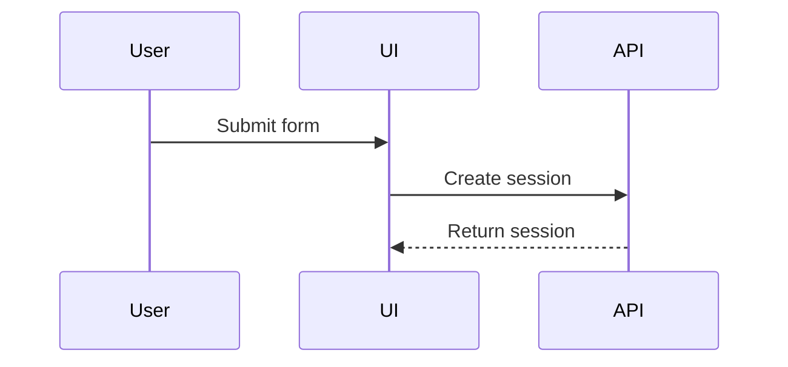

# Visual guidance

Use a visual when it explains structure, flow, state, or change more clearly than prose. Choose the smallest visual that makes the point clear. Do not add a visual only for decoration.

Place each visual next to the text that it supports. Introduce its purpose in one sentence. Explain any conclusion that is not immediately clear from the visual.

## Choose a format

Match the format to the information:

- Use pseudocode for logic or an algorithm.
- Use a call tree for runtime control flow.
- Use a component tree for user-interface structure and relevant boundaries.
- Use a shallow file tree for file responsibilities or a broad refactor.
- Use Mermaid for interactions, control flow, data flow, or state transitions.
- Use a diff when the existing and proposed shapes are the main point.
- Use a complete code block when most of the content is new or must be copied.
- Use a focused Hypertext Markup Language (HTML) diagram or infographic when the concept is too dense for Mermaid or when visual layout is the subject.

Use multiple formats only when each one answers a different question.

## Keep visuals focused

- Include only relevant calls, files, components, states, and boundaries.
- Use real names, labels, and paths from the system.
- Keep trees shallow and flows directional.
- Put short annotations beside the element they describe.
- Match an HTML visual to the product's colors, typography, and components.
- Support desktop and mobile layouts when the HTML visual represents a user interface.
- Add a short text alternative when a visual contains information that is not available in the surrounding prose.

## Examples

Show an algorithm as pseudocode:

```text
on(save)
  if content is unchanged
    return cached result
  write new content
  return fresh result
```

Show runtime control flow as a call tree:

```text
submitForm
  createSession
    persistPrompt
    launchAgent
  navigateToSession
```

Show file responsibilities as a shallow tree:

```text
src/
|-- commands/       # parses user actions
|-- sessions/       # owns session state
`-- transport/      # sends API requests
```

Show interactions with Mermaid:



Show a change as a structural diff:

```diff
 submitForm
   createSession
     persistPrompt
+    expandSkillMention
     launchAgent
-  navigateToSession
+  navigateToSession
+    subscribeToEvents
```
