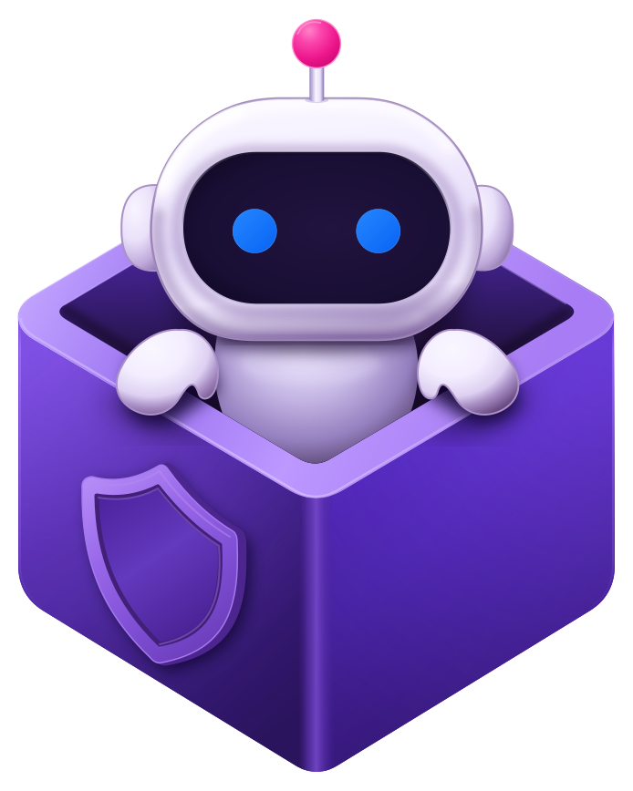
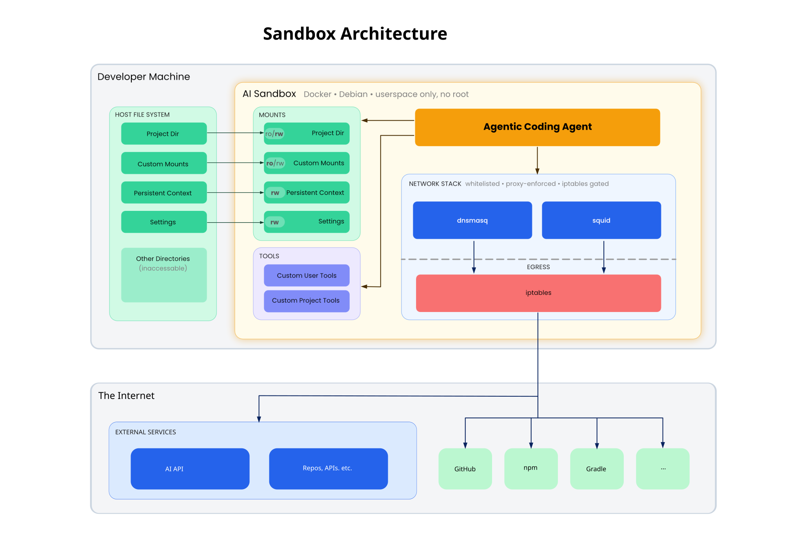

<p align="center">
  
</p>

<h1 align="center">Sandbox</h1>

Run coding agents in isolated containers. Limit their access to host files and network services.

- Mount the current project instead of the complete host filesystem.
- Allow only the network domains that the agent needs.
- Run longer agent tasks without approving each command.

> [!TIP]
> **Need help setting up, customizing, or debugging Sandbox?** Run `sandbox assist`. It starts one of your installed coding agents with Sandbox's documentation and configuration paths already in context.
>
> ```bash
> sandbox assist
> ```

Bringing AI coding agents into your team? [MaibornWolff](https://www.maibornwolff.de/) combines software engineering, cloud, cybersecurity, and AI expertise to help you build and modernize software responsibly.

## Quick Start

### Prerequisites

- Install and start Docker, Podman, or Apple `container`.
  - On Windows, use Rancher Desktop with the Windows Subsystem for Linux 2 (WSL2) backend or use Podman.
  - On macOS or Linux, use Docker with [Colima](https://colima.run/), Rancher Desktop, or Podman.
  - Apple `container` requires Apple silicon, macOS 26 or newer, and version 1.4.1 or newer. Start it with `container system start`.

### Install

```bash
npm install -g @maibornwolff/sandbox
# or
bun install -g @maibornwolff/sandbox
```

### 1. Initialize (first time only)

```bash
sandbox init
```

This command creates the recommended configuration files. The files include application programming interface (API) key forwarding and agent settings.

Review `~/.config/sandbox/config.toml`. Add required API keys.

### 2. Verify your setup

```bash
sandbox doctor
```

This command checks the container runtime and configuration files. It also checks the optional X Window System (X11) clipboard setup.

### 3. Run an agent in your project

```bash
cd your-project
sandbox run claude      # or: sandbox run codex, sandbox run opencode
```

The first run builds a container image. Later runs can use the cached image. The agent has read-write access to the mounted project directory.

### 4. Ask Sandbox for help

Start an agent with the Sandbox documentation and configuration paths in its context:

```bash
sandbox assist
```

Then ask the agent to customize your setup, explain an option, or debug a problem.

### Updating

```bash
sandbox update                    # Update sandbox CLI to latest version
sandbox upgrade                   # Rebuild all images with latest tools and agents
sandbox upgrade --user            # Only rebuild your global tools (agents, runtimes)
sandbox upgrade --project         # Only rebuild project-specific tools
docker system prune               # Clean up old images to free disk space
```

`sandbox update` checks for a new version. It asks for confirmation before installation. It runs `sandbox config update` when configuration templates changed.

`sandbox config update` generates user configuration files from the latest templates. It shows each change before it modifies a file. You can overwrite the file, open a diff editor, or skip the change.

## AI-Assisted Setup and Troubleshooting

`sandbox assist` starts an installed coding agent with Sandbox-specific context. The context includes:

- The installed README, detailed documentation, and full TypeScript source code
- Your user and project configuration paths
- Your user and project Dockerfiles
- Guidance for choosing the correct configuration scope
- Access to the full configuration schema through `sandbox config schema`

Run it from your project directory so the agent can inspect the relevant project configuration and make changes for you:

```bash
# Auto-detect an installed agent
sandbox assist

# Or choose any supported agent explicitly
sandbox assist --agent claude
sandbox assist --agent codex
sandbox assist --agent copilot
sandbox assist --agent pi
sandbox assist --agent opencode

# You can also ask a direct question
sandbox assist "How do I persist node_modules?"
```

Sandbox auto-detects supported installed agents, including Claude Code, Codex, GitHub Copilot, Pi, and OpenCode. Some agents require a question for automatic launch. If interactive launch is not supported, Sandbox writes the context to a temporary file and tells you how to continue.

For the best experience, run `sandbox assist` on the host. When called inside a container, it can still answer questions, but configuration changes must be made on the host.

## What Can the Agent Access?

The agent runs in an isolated container with the following file access:

### Files

| What                          | Access                   | Details                                                                                                                     |
| ----------------------------- | ------------------------ | --------------------------------------------------------------------------------------------------------------------------- |
| Your project directory        | **read-write**           | The git repo you run the sandbox from. Includes hidden folders like `.github/`.                                             |
| Additional mounts (`--mount`) | **read-only** by default | Add `:rw` for write access: `--mount /data:rw` (read-write)                                                                 |
| Persistent paths              | **read-write**           | Configured paths that remain after the container stops, such as agent credentials and shell history. See [Persistence](#persistence). |
| Other host paths              | **not accessible**       | Sandbox does not mount the home directory, other projects, or Secure Shell (SSH) keys unless you configure them.                  |

If you start the sandbox from a subdirectory of a git repo, the **entire repo** is mounted (not just the subdirectory).

### Network

Outbound network access is blocked by default. The built-in allowlist includes common artificial intelligence (AI) services, package registries, and code hosts. Add required domains to `allow_network` in `config.toml`. See [Network Firewall](#network-firewall).

### Persistence

Project files remain on the host and are mounted into the container. Data outside a mounted path is lost when the container stops.

Add a path to `persist_paths` to keep data such as agent credentials or shell history. See [Persistence](#persistence-config). The built-in configuration includes common paths.

## Daily Usage

```bash
sandbox assist          # Open an agent with Sandbox context
sandbox run claude      # Run an agent (also: codex, opencode)
sandbox                 # Interactive zsh shell in the container
sandbox run npm test    # Run any command
sandbox run --silent npm test   # Hide Sandbox logs, keep command output visible
sandbox run -- sh -c 'echo "$HOME"'   # Use '--' to pass flags to the command
```

### Run allowed host commands

Use `sandbox escape` inside a normal Sandbox session to run a configured command on the host. Each rule matches one complete argument vector:

```toml
# Exact arguments
[[allow_host_commands]]
pattern = ["bun", "run", "test:e2e"]

# One argument selected from alternatives
[[allow_host_commands]]
pattern = ["git", ["status", "diff", "log"]]
test_match = [["git", "status"], ["git", "diff"]]
test_no_match = [["git", "push"], ["git", "status", "--short"]]

# One wildcard argument followed by zero or more arguments
[[allow_host_commands]]
pattern = ["tool", "?", "*", "done"]
test_match = [["tool", "one", "done"], ["tool", "one", "two", "done"]]
test_no_match = [["tool", "done"], ["tool", "one", "two"]]

# One complete argument matched by a regular expression
[[allow_host_commands]]
pattern = ["tool", { regex = 'profile-[0-9]+', flags = "i" }]

# One to ten HTML files or web URLs
[[allow_host_commands]]
pattern = ["open", { repeat = [{ regex = 'https?://\S+' }, { regex = '[^-:][^:]*\.html?', flags = "i" }], min = 1, max = 10 }]
test_match = [["open", "report.html"], ["open", "https://example.com"]]
test_no_match = [["open"], ["open", "-a", "Terminal"], ["open", "file:///tmp/report.html"]]
```

The executable is always an exact, non-empty string. In later pattern segments, `?` matches one complete argument and `*` matches zero or more complete arguments. You can put `*` in the middle of a pattern. A nested array gives alternatives for one argument. You can use `?` in an alternative or a `repeat` matcher. You can use `*` only as a top-level pattern segment. Other strings are exact arguments, so `file*` is literal. A regular expression matches one complete argument and is automatically anchored. `flags = "i"` makes it case-insensitive. A `repeat` matcher consumes between `min` and `max` consecutive arguments. Both bounds are required. `max` cannot be more than 32.

Use an anchored regular-expression matcher when the command needs a literal `*` or `?` argument:

```toml
pattern = ["tool", { regex = '\*' }, { regex = '\?' }]
```

`test_match` and `test_no_match` contain complete argument vectors. Sandbox runs these rule tests when it loads the configuration. It rejects the configuration if an example has the wrong result. Keep each inline matcher object on one physical line, as required by TOML 1.0.

```bash
sandbox escape --list
sandbox escape -- open report.html
sandbox escape -- bun run test:e2e
```

Use `--` before the host command. Sandbox sends the original argument list directly to the host. It does not use a shell. A rule must consume all arguments.

The host combines user rules and trusted project rules in that order. It removes duplicate patterns and preserves the first rule. `sandbox escape --list` prints each effective pattern as compact JSON, without tests or a heading:

```text
["bun","run","test:e2e"]
["git",["status","diff","log"]]
["open",{"repeat":[{"regex":"https?://\\S+"},{"regex":"[^-:][^:]*\\.html?","flags":"i"}],"min":1,"max":10}]
```

An allowed command runs with your host user permissions and host environment. It runs from the matching directory in the host project. Treat each rule as a host security exception. Broad commands such as unrestricted Docker access can expose the complete host. Arbitrary allowed HTTP or HTTPS URLs can disclose data through the URL. Restrict the URL expression to trusted hosts when necessary.

#### Migrate old host command patterns

Sandbox rejects the old string format. Replace each string with an array table. Review each `*` before you add it because it allows any number of complete arguments.

Old configuration:

```toml
allow_host_commands = ["open *", "bun run test:e2e"]
```

New configuration:

```toml
[[allow_host_commands]]
pattern = ["open", "*"]

[[allow_host_commands]]
pattern = ["bun", "run", "test:e2e"]
```

### Container reuse

Containers are reused across runs when the sandbox version, image, and configuration match. This means:

- Starting a second `sandbox run claude` in the same project reuses the running container
- Multiple sessions share one container (check with `sandbox status`)
- Containers auto-stop when all sessions end

Use `--no-container-reuse` (or `-u`) to force a fresh container.

### Silent runs

Use `sandbox run --silent <cmd>` or `sandbox run -s <cmd>` to hide Sandbox logs for one run. The wrapped command keeps its standard output, standard error, standard input, terminal behavior, and exit code.

`--silent` is only available on `sandbox run` and cannot be combined with `--verbose`.

### Host terminal managers and Herdr

When you run a known agent such as `sandbox run pi`, `sandbox run claude`, or `sandbox run codex`, the host-side sandbox process temporarily uses that agent name while the container exec session runs. Host terminal managers such as Herdr can then classify the pane from the host process and use screen detection on the terminal output. See the [Herdr agent documentation](https://herdr.dev/docs/agents/).

### Managing containers

```bash
sandbox status          # Show running containers and active sessions
sandbox stop            # Stop current project's containers
sandbox stop --all      # Stop all sandbox containers
sandbox clean           # Remove stopped containers and dangling images
sandbox clean --data    # Also remove persistent data
```

## Network Firewall

By default, sandbox restricts outbound network access to allowed domains.

### Adding domains

Add domains to your config:

```toml
allow_network = [
  "api.example.com",
  "*.example.com",              # Matches example.com and all subdomains
  "db.example.com:5432",        # Custom port
  "git.example.com:{22,443}",   # Multiple ports
  "service.example.com:*",       # All TCP ports for this host
  "*.internal.example.com:{*}",  # Equivalent all-port form with a domain wildcard
]
```

Or use a command-line interface (CLI) flag:

```bash
sandbox --allow-network api.example.com run claude
```

### Interactively allowing domains

Use `sandbox network allow` to interactively pick blocked domains from the firewall logs and add them to your config.

### Debugging blocked requests

If the firewall blocks an operation:

1. Run `sandbox --full-network run claude`.
2. Repeat the blocked operation.
3. Run `sandbox network logs --status=all`.
4. Identify the required domains.
5. Add the domains to `allow_network` in your configuration file.

### Viewing network logs

```bash
sandbox network logs                # Show blocked requests (default)
sandbox network logs --status=all   # Show blocked + allowed requests
sandbox network logs --raw          # Full raw network diagnostic bundle
sandbox network logs --no-resolve   # Skip reverse DNS (faster)
```

Use `--raw` while the failure occurs and the container is running. The output includes recent container logs, resolver state, routes, network processes, firewall rules, blocked packets, and proxy logs. Redirect the output to a file for an intermittent failure:

```bash
sandbox network logs --raw > sandbox-network-debug.log
```

Example output:

```
CONTAINER             DESTINATION                       PORT  COUNT LAST SEEN STATUS
abc123de (myproject)  api.stripe.com                    443   15    2m ago    BLOCKED
abc123de (myproject)  cdn.segment.io                    443   3     5m ago    BLOCKED

Note: Use --status=all to also show allowed requests.
Tip:  Run sandbox network allow to interactively add domains to config
```

### Disabling the firewall

For unrestricted network access:

```toml
# ~/.config/sandbox/config.toml
full_network = true
```

Or per-run: `sandbox --full-network run claude`

**Note:** The firewall uses rules set at container startup. The sandbox user cannot modify these rules after initialization.

### Limitations

- **Rate limiting**: Blocked logs are limited to 10/min (burst 20). High-volume blocked traffic may be underreported.
- **Reverse Domain Name System (DNS) lookup**: A reported hostname might differ from the requested hostname because one Internet Protocol (IP) address can serve several domains.
- **Internet Protocol version 6 (IPv6)**: The log parser does not report IPv6 connections.

## Configuration

Sandbox reads four configuration layers. Arrays such as `mounts`, `env`, `allow_network`, and `allow_host_commands` accumulate. Single-value settings such as `readonly` and `full_network` override earlier values:

```
Built-in defaults
  → ~/.config/sandbox/config.toml       (user configuration)
    → .sandbox/config.toml              (project configuration)
      → CLI flags                       (--mount, --env, --port)
```

Run `sandbox config` to see your final merged configuration.

### Container runtime

Sandbox detects runtimes in this order: Docker, Podman, then Apple `container`. Set a runtime when you do not want automatic selection:

```toml
runtime = "apple-container" # Or "docker" or "podman"
```

Apple `container` uses its default resolver. If the runtime DNS proxy does not answer, select the primary host resolver:

```toml
[runtimes.apple-container]
dns = "host"
```

Supported values are `default`, `host`, and `host-ipv6`. The default is `default`.

- `default` does not change the Apple resolver or an externally configured builder.
- `host` reads the current macOS primary DNS configuration. It selects the first server that is not a loopback or link-local address. It does not substitute a public DNS server or select a resolver from another network interface. Use this mode when the host DNS server is reachable from containers but the runtime DNS proxy is not. Local-only DNS services are not supported. Domain-specific VPN resolvers are not selected.
- `host-ipv6` discovers the macOS IPv6 bridge resolver. This mode requires a working host IPv6 DNS proxy.

Sandbox does not save discovered resolver addresses or interfaces. In `host` and `host-ipv6` modes, Sandbox changes a stopped shared builder only when its effective resolver differs. If a running shared builder has different settings, wait for active builds to finish. Then run `container builder stop` and retry.

In `host` and `host-ipv6` modes, Sandbox checks the shared builder resolver before each image build. If a stopped process left a builder DNS lock, Sandbox reports the lock file and stops. Confirm that no Sandbox builds are running before you remove the reported lock file. Then retry the build. Sandbox does not automatically remove another process's lock.

Apple uses `host.container.internal` for host access. It also provides `host.docker.internal` as a compatibility alias. These aliases match only the exact names, not subdomains. Host services must listen on an address that the Apple container gateway can reach. Services that listen only on localhost are not supported.

### User configuration

The user configuration is at `~/.config/sandbox/config.toml`. On Windows, it is at `%APPDATA%/sandbox/config.toml`.

Create or reset it with `sandbox init`.

### Project configuration

Project-specific settings live in your project folder:

- `.sandbox/config.toml` - project configuration
- `.sandbox/docker/Dockerfile` - project-specific Docker image

Create them with `sandbox init --project`.

#### Trust project configuration

Project configuration can change mounts, network access, and Docker image layers. Sandbox asks you to trust the `.sandbox/` directory before it uses these files. It asks again after a file changes.

For continuous integration (CI), use `--trust` or set `SANDBOX_TRUST_ALL=1`.

Trust decisions are stored in `~/.config/sandbox/trusted-projects.json` as SHA-256 hashes.

### Persistence configuration

Configure `persist_paths` to keep data across container restarts:

```toml
persist_paths = [
  { path = "~/.claude" },                                    # Per-project agent state
  { path = "~/.claude/.credentials.json", global = true },   # Shared across all projects
  { path = "./node_modules", only_if_exists = true },        # Separate from host to avoid native dependency conflicts
  { path = "./**/node_modules" },                            # Same for monorepo packages
]
```

| Option                  | Meaning                                             |
| ----------------------- | --------------------------------------------------- |
| `path = "~/.foo"`       | Persisted per-project (`~` = container home)        |
| `path = "./foo"`        | Relative to project root                            |
| `path = "./**/foo"`     | Glob pattern (e.g., for monorepos)                  |
| `global = true`         | Shared across all projects (e.g., credentials)      |
| `only_if_exists = true` | Only persist if the path already exists on the host |

The default config already persists agent credentials, shell history, and common dependency folders.

### Agent skills

`~/.agents/skills/` is a shared directory for skills available to all agents inside the container. Skills placed there are mounted read-only into each agent's skills directory:

- `~/.claude/skills/` (Claude Code)
- `~/.codex/skills/` (Codex)

Create the directory and add skills on your host:

```sh
mkdir -p ~/.agents/skills
# add skills here - they appear in all agents on next container start
```

The directory is also mounted at `~/.agents/` inside the container with write access, so agents can create new skills there directly.

### Shell customization

The container sources local shell customization files so you can extend the default shell configuration without replacing it.

Use `~/.zshrc.local` for interactive zsh settings:

```zsh
# ~/.config/sandbox/settings/.zshrc.local
alias ll='ls -la'
alias gs='git status'
PROMPT='%F{cyan}[sandbox]%f %F{yellow}[dev]%f %F{blue}%~%f %F{green}❯%f '
```

Use `~/.profile.local` for environment setup that should also apply to non-interactive commands:

```sh
# ~/.config/sandbox/settings/.profile.local
export PATH="$HOME/.local/bin:$PATH"
```

For this to work, both files must be in your settings patterns (included by default since `sandbox init`):

```toml
# ~/.config/sandbox/config.toml
settings = [
  "~/.zshrc.local",
  "~/.profile.local",
]
```

Changes apply on the next `sandbox run` or `sandbox` session.

### CLI flags

Common global flags (available for `sandbox` and subcommands like `sandbox run`):

- `-m, --mount <mount>` Add extra mounts
- `-e, --env <env>` Pass/set environment variables
- `-p, --port <port>` Expose container ports
- `-n, --allow-network <host>` Allow outbound host/domain through firewall
- `-N, --full-network` Disable network firewall (allow all outbound)
- `-r, --readonly` Mount project read-only
- `-c, --clipboard <mode>` Clipboard mode (`auto`, `x11`, `disabled`)
- `-v, --verbose` Show detailed timing output
- `-t, --trust` Trust project config without prompting
- `-u, --no-container-reuse` Force a fresh container

Run-only flags:

- `-s, --silent` Suppress Sandbox logs while preserving wrapped command output. Cannot be combined with `--verbose`.

Examples:

```bash
sandbox --mount /data:rw --env DEBUG=1 run claude
sandbox --port 3000 --allow-network api.example.com run claude
sandbox --readonly --clipboard disabled run claude
```

## Customizing the Docker Image

### Image layers

Sandbox uses three Docker image layers:

```
sandbox-base (Debian + git + Python + networking tools)
  → sandbox-user (~/.config/sandbox/docker/Dockerfile)
    → sandbox-<project-slug> (.sandbox/docker/Dockerfile)
```

Add tools at any level. Images are cached and only rebuild when their content changes.

### Building and upgrading

```bash
sandbox build                 # Rebuild changed layers
sandbox build --user          # Rebuild only user layer
sandbox build --project       # Rebuild only project layer
sandbox upgrade               # Rebuild all layers from scratch (no cache)
sandbox upgrade --user        # Fresh rebuild of user layer (e.g., update agents)
sandbox upgrade --project     # Fresh rebuild of project layer
```

**Tip:** Run `docker system prune` after upgrades to reclaim disk space from old images.

### Project-specific tools

For a project that needs a specific runtime or tool:

```bash
cd your-project
sandbox init --project    # Detects mise.toml, devbox.json, composer.json, etc. and pre-selects tools
sandbox build --project   # Build the project layer
```

## Commands Reference

| Command                  | Description                                   |
| ------------------------ | --------------------------------------------- |
| `sandbox`                | Interactive shell in container                |
| `sandbox run <cmd>`      | Run command in container                      |
| `sandbox escape -- <cmd>` | Run an allowed command on the host           |
| `sandbox escape --list`  | List allowed host command patterns            |
| `sandbox assist`         | Start an agent for setup and troubleshooting  |
| `sandbox init`           | Create user-level configuration files         |
| `sandbox init --project` | Create project-level configuration files      |
| `sandbox update`         | Update sandbox CLI to latest version          |
| `sandbox build`          | Rebuild Docker images                         |
| `sandbox upgrade`        | Rebuild with fresh packages (no cache)        |
| `sandbox pull`           | Pull the base Docker image                    |
| `sandbox config`         | Show merged configuration                     |
| `sandbox config update`  | Update user config from latest templates      |
| `sandbox status`         | Show running containers and sessions          |
| `sandbox stop`           | Stop current project's containers             |
| `sandbox stop --all`     | Stop all sandbox containers                   |
| `sandbox clean`          | Remove stopped containers and dangling images |
| `sandbox clean --data`   | Also remove persistent data                   |
| `sandbox doctor`         | Check configuration and environment           |
| `sandbox network logs`   | Show firewall activity (blocked/allowed)      |
| `sandbox network allow`  | Interactively add domains from logs to config |
| `sandbox setup-x11`      | Configure X11 clipboard support               |

## Troubleshooting

Not sure where to start? Run `sandbox assist` and describe the problem to the agent. It receives the Sandbox docs and relevant configuration paths automatically.

**Container cannot access files?**

- Check the project root detection (looks for `.git` or `.sandbox` directory)
- Use `--mount` for directories outside your project

**Permission errors?**

- Container UID/GID matches your host user automatically
- Run `sandbox build` after Dockerfile changes

**EACCES errors during build (especially on Windows)?**

- BuildKit cache mounts may have stale permissions from previous builds
- Run `docker builder prune` to clear the build cache, then rebuild

**buildx component is missing or broken (with Colima on Mac)?**

- Install buildx with brew `brew install docker-buildx`
- Create plugins directory `mkdir -p ~/.docker/cli-plugins`
- Link your brew-installation `ln -sfn $(brew --prefix docker-buildx)/bin/docker-buildx ~/.docker/cli-plugins/docker-buildx`
- Verify with `docker buildx version`

**Agent not found?**

- Run `sandbox upgrade` to rebuild with latest agents

**Codex login inside the container fails?**

- Avoid the normal `codex login` flow inside the container. It uses a localhost browser redirect, which may not round-trip correctly from the host browser back into the container.
- The default config mounts the host Codex login read-only so `sandbox run codex` can use an existing host session:
  ```toml
  mounts = [
    "~/.codex/auth.json:ro",
  ]
  ```
- If you use an older config, add that mount manually.
- This shares the host Codex session with the container. Logging out affects both sides, and token refresh should happen on the host.
- For a separate container session, remove the mount and use Codex's device auth flow with `codex login --device-auth`. Device auth must also be enabled in the ChatGPT web UI.
- To persist a separate device-auth login across restarts, add a global persist entry for the auth file:
  ```toml
  persist_paths = [
    { path = "~/.codex/auth.json", default = "{}", global = true },
  ]
  ```

**`gh` or `glab` not authenticated inside the container?**

- Credentials are not mounted automatically. Add the relevant config directory to your settings patterns so the host session is available inside:
  ```toml
  # ~/.config/sandbox/config.toml or .sandbox/config.toml
  settings = [
    "~/.config/gh",        # GitHub CLI
    "~/.config/glab-cli",  # GitLab CLI
  ]
  ```
- Run `sandbox build` after changing settings patterns.
- String settings entries use read-write bind mounts. Changes inside the container, such as `gh auth login`, affect the host directly. Use [copy mode](docs/SETTINGS-SYNC.md#copy-mode) when the host file must stay unchanged.

**"Untrusted project config" error in CI?**

- Pass `--trust` flag or set `SANDBOX_TRUST_ALL=1` environment variable
- This is expected: project configs require explicit trust for security

**Network requests being blocked?**

- Run `sandbox network logs` to see which domains are blocked
- Use the [debugging workflow](#debugging-blocked-requests) to find required domains
- Check for redirect domains (e.g., `*.githubusercontent.com` for GitHub downloads)

**Gradle/Java downloads fail behind the firewall?**

- Sandbox sets `JAVA_TOOL_OPTIONS` with proxy settings automatically
- If Gradle still fails, check `sandbox network logs`. You may need to allow additional domains (e.g., `*.gradle.org`, `*.maven.org`)

**Build fails with "Could not connect to 127.0.0.1:8888"?**

- Update to the latest sandbox version: `npm i -g @maibornwolff/sandbox@latest`
- Then rebuild: `sandbox build`

**Build fails with GitHub API rate limit (403)?**

- Tools like `uv`, `bun`, and `rust` are downloaded from GitHub during `mise use`
- Without authentication, GitHub's API limit (60 requests/hour) can be hit quickly
- Create a token at https://github.com/settings/tokens (no scopes needed for public repos)
- Add it to your `~/.zshrc` or `~/.bashrc`:
  ```bash
  export GITHUB_TOKEN=ghp_your_token_here
  ```
- Restart your shell or run `source ~/.zshrc` to apply
- Sandbox automatically forwards this token into the Docker build

**mise says folders are untrusted?**

- The default config sets `MISE_TRUSTED_CONFIG_PATHS=/` inside the container
- If you use an older configuration file, run `sandbox init` to get the latest defaults

## Security Model



### What we protect against

Sandbox is designed to protect against **agent errors and prompt injection attacks**:

- An agent cannot run `rm -rf /` against unmounted host paths.
- An agent cannot read unmounted SSH keys.
- The network firewall blocks domains outside the allowlist.
- Host commands are unavailable unless a trusted allowlist pattern permits the complete argument list.

### How it works

- The container runtime isolates agent processes from the host.
- Explicit mounts define which host files are available.
- The agent runs as a non-root user.
- A managed network path restricts outbound traffic to allowed domains.
- Project configuration requires trust before Sandbox applies it.

### Known limitations

- **Not designed to defend against root escalation.** If the sandbox user could somehow gain root inside the container, they could modify the firewall. For the threat model (agent errors, prompt injection), this is sufficient.
- **Project configuration is writable.** The agent can modify `.sandbox/config.toml` because it is in the project directory. Changes apply after the next container start.
- **Domain Name System (DNS) exfiltration** through crafted subdomains such as `secret.attacker.com` is possible for allowed wildcard domains.
- **Allowed host commands leave the container boundary.** They run with the host user permissions and host environment. A broad pattern can give an agent indirect access to files, processes, or the container runtime.

### Why Docker?

Coding agents run arbitrary commands on your machine. A prompt injection or hallucination could run `rm -rf /` or steal your SSH keys. Different tools handle this differently.

```
Less isolated                                        More isolated
     │                                                     │
     ▼                                                     ▼
┌─────────┐  ┌────────────┐  ┌────────┐  ┌─────────┐  ┌─────────┐
│ Nothing │──│ OS Sandbox │──│ Docker │──│ Full VM │──│ Cloud   │
└─────────┘  └────────────┘  └────────┘  └─────────┘  └─────────┘
                                 ▲
                                 │
                            Our approach
```

**No Sandbox** (default for most agents): You review every command. Autonomous workflows are off the table. Prompt injection can hide malicious commands.

**OS-Level Sandbox**: Wraps a single process with OS primitives (`sandbox-exec`, `bubblewrap`). Lightweight, but only covers one process. Agents need a whole environment (subprocesses, tmux, browsers). No Windows support.

**Docker containers** (the Sandbox approach): Separate the filesystem and processes from the host. Docker-compatible runtimes support the required mounts and network rules. Host tools are unavailable unless you install or mount them. A container escape remains a risk.

**Full VM / Cloud VM**: Stronger isolation (separate kernel), but heavy resource overhead, slow startup, and painful file sharing. Good for high-security or async CI environments, not daily local development.

### Why not an existing solution?

We evaluated existing tools and none offered the combination we needed: cross-platform support without proprietary desktop runtimes, domain-level network control, and customizability that adapts to both user preferences and project-specific needs.

- **[Sandbox Runtime (srt)](https://github.com/anthropic-experimental/sandbox-runtime)**: OS-level process sandbox by Anthropic. Good for simple workflows, but wraps a single process. Agents need a whole environment (subprocesses, tmux, headless browsers) and it falls short there. File reads use a deny-list (everything is readable unless explicitly blocked), while a container only exposes what you mount. No Windows support.

- **[Docker Sandboxes](https://docs.docker.com/ai/sandboxes/)**: Runs agents in microVMs with private Docker daemons. Strong isolation, but requires a proprietary desktop runtime with paid licenses. Higher resource consumption than our threat model needs. Doesn't work with Colima or Podman.

- **[yolobox](https://github.com/finbarr/yolobox)**: Docker-based sandbox in Go, similar spirit. No network firewall (only on/off), no layered images, no config cascade. Less adaptable to project-specific needs.

- **[ClaudeBox](https://github.com/RchGrav/claudebox)**: Docker-based sandbox as a bash script. Claude-focused. No domain-level network control, no layered image system.

- **[Claude Code .devcontainer](https://github.com/anthropics/claude-code/tree/main/.devcontainer)**: VS Code devcontainer with iptables firewall. Resolves domains to IPs at startup, which is fragile since IPs rotate. No standalone CLI, no config management.

- **[clamp](https://github.com/Richargh/clamp)**: Docker for filesystem isolation combined with Claude Code hooks to intercept individual tool calls (Bash, WebFetch, file operations). Simpler and more lightweight than running the whole agent in a container, and reuses your existing `~/.claude` config from the host. But it relies on Claude Code-specific features and does not work with other agents.

- **[Firejail](https://firejail.wordpress.com/)**: Linux-only OS sandbox designed for desktop apps. Not built for developer or agent workflows.

Sandbox is designed to be **agent-agnostic** (Claude, Codex, OpenCode, or any command), **cross-platform** (Docker, Podman, Colima, Rancher Desktop), and **fully customizable** (layered images for user and project needs, config cascade from defaults to CLI flags, granular persistence and network control).

## X11 Clipboard (Optional)

Image paste is disabled by default. Configure an X11 server on the host to enable it:

```bash
sandbox setup-x11
```

See the full guide: [docs/X11-SETUP](./docs/X11-SETUP.md).

## Windows Notes

Sandbox supports Windows with a compatible container runtime.

Sandbox converts Windows paths such as `C:\Users\...` to paths such as `/mnt/c/users/...` for container runtime compatibility.

## Architecture

Sandbox separates host control, container execution, filesystem access, network policy, persistent data, and image customization.

See the **[Architecture Documentation](./docs/ARCHITECTURE.md)** for the system boundaries, responsibilities, lifecycle, and design trade-offs.

## Development

### Requirements

- Bun
- Docker or Podman

### Commands

```bash
bun check             # Run all checks
bun run build         # Build binary
```

### Contributing

Read [CONTRIBUTING.md](CONTRIBUTING.md) before you open a pull request.

## License

Sandbox is available under the [BSD 3-Clause License](LICENSE).

Report vulnerabilities through the process in [SECURITY.md](SECURITY.md).
