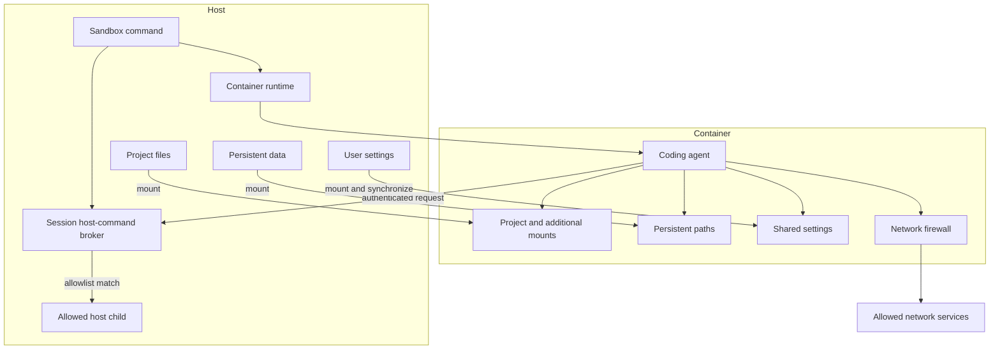
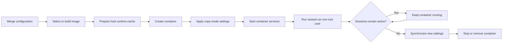

# Architecture

Sandbox runs artificial intelligence (AI) coding agents in isolated containers. The system limits which host files and network services an agent can access.

## Design Goals

Sandbox has these design goals:

- Isolate agent processes from the host.
- Expose only selected host files.
- Restrict outbound network access.
- Keep selected data between container runs.
- Support user and project customization.
- Provide the same behavior across supported container runtimes.

Sandbox reduces risk from agent errors and prompt injection. It does not replace container runtime security.

## System Boundary

The container is the main trust boundary.

The host starts and controls the container. The agent runs inside the container as a non-root user.

## Main Responsibilities

### Host command

The host command:

- reads and merges configuration
- selects or builds the container image
- prepares a versioned, content-identified runtime cache
- creates mounts
- starts and stops containers
- starts agent sessions
- starts one authenticated host-command broker for each normal session
- reports status and diagnostic information

### Container environment

The container environment:

- provides development tools
- runs the coding agent
- applies the configured filesystem access
- applies the configured network policy
- applies copy-mode settings before container readiness
- manages session lifetime
- synchronizes new mount-mode settings during a normal stop

### Container runtime

Docker or Podman provides process and filesystem isolation. The runtime also creates mounts, networks, images, and volumes.

## Configuration Model

Sandbox reads configuration from four layers:

1. Built-in defaults
2. User configuration
3. Project configuration
4. Command-line interface (CLI) flags

Array values accumulate across layers. Single-value settings override earlier values.

This model separates shared preferences from project requirements. See [Configuration Cascade](./CONFIG-CASCADE.md).

## Filesystem Model

Sandbox exposes host data through explicit mounts.

- The project mount provides the agent workspace.
- Additional mounts expose selected host paths.
- Persistent paths keep selected container data.
- Mount-mode settings share user configuration through bind mounts.
- Copy-mode settings replace container paths from the host source at each start.

Host paths that are not mounted are not available inside the container.

See [Data Flow](./DATA-FLOW.md), [Mounts](./MOUNTS.md), and [Persistence](./PERSISTENCE.md).

## Image Model

Sandbox uses three image layers:

1. The base layer provides the operating system and common tools.
2. The user layer provides tools for all projects.
3. The project layer provides tools for one project.

A change rebuilds the affected layer and its child layers. This design keeps user and project customization separate.

Runtime program files are separate from image layers. `modules/sandbox-runtime` owns their package validation, identity, host cache paths, atomic publication, preparation leases, and cleanup. The leases prevent cleanup from removing a runtime between cache preparation and container creation. `modules/sandbox-containers` combines the cached runtime bind mount with a tool image at startup. Configuration does not construct these resources.

Runtime files are copied into the Sandbox data directory and mounted read-only. Runtime-only changes select a different container without rebuilding tool images. The container runtime does not need access to the host installation path.

See [Layered Images](./LAYERED-IMAGES.md).

## Network Model

Outbound network access uses a domain allowlist. The network system has three responsibilities:

- resolve allowed domains
- route supported traffic through a domain-aware proxy
- block direct outbound connections

Full-network mode keeps the network path but disables domain filtering.

A normal session can reach its host-command broker through the container runtime host name, such as `host.docker.internal` or `host.containers.internal`. The existing network path permits this host connection. The broker still requires its session token and command allowlist. Sandbox does not add a broader network-policy exception.

See [Network Firewall](./NETWORK-FIREWALL.md).

## Container Lifecycle

A normal session follows this sequence:

1. Merge configuration.
2. Select or build the image.
3. Prepare the runtime cache, then create the container with its read-only bind mount and network policy. Stop startup if runtime preparation fails.
4. Apply copy-mode settings. Stop startup if this operation fails.
5. Start required container services.
6. Start a host-command broker for the normal execution session.
7. Run the requested command as the non-root user.
8. Stop the broker and its active host children when the execution ends.
9. Keep the container available while sessions remain active.
10. Synchronize new mount-mode settings during a normal stop.
11. Stop or remove the container according to the command and configuration.
12. After the session ends, remove old runtime caches when scheduled and no container references them.

Sandbox can reuse a compatible running container. A configuration, image, or runtime-content change requires a different container.

## Data Ownership

| Data | Owner | Lifetime |
| --- | --- | --- |
| Project files | Host project | Independent of the container |
| User settings | Host configuration directory | Shared between projects |
| Per-project persistent data | Sandbox data directory | One project |
| Global persistent data | Sandbox data directory | Shared between projects |
| Temporary container data | Container | Until the container is removed |
| Image layers | Container runtime | Until image cleanup |
| Runtime package cache | Sandbox runtime component | Until unused and removed by scheduled cleanup |

## Security Boundaries

Sandbox relies on these boundaries:

- The container runtime isolates processes and the container filesystem.
- Explicit mounts define host filesystem access.
- The network allowlist defines external network access.
- The non-root container user limits changes to protected container state.
- Project configuration requires trust before Sandbox applies it.
- The host-command broker checks a session token and the complete argument vector before it starts a host process.
- Each host-command rule requires an exact executable and must consume all arguments.
- Regular expressions match one complete argument. Repetition has a configured minimum and maximum.

Host command escape is an explicit exception to the container boundary. Each allowed command runs with the host user permissions and host environment. The broker exists only for the matching normal execution session. It does not start for `sandbox container start`. An allowed HTTP or HTTPS URL can disclose data through the URL.

These boundaries do not prevent every attack. An allowed domain can receive data. A writable project can change project configuration for a later run. A container runtime vulnerability can break isolation.

## Related Documents

- [Configuration Cascade](./CONFIG-CASCADE.md)
- [Data Flow](./DATA-FLOW.md)
- [Layered Images](./LAYERED-IMAGES.md)
- [Mounts](./MOUNTS.md)
- [Network Firewall](./NETWORK-FIREWALL.md)
- [Persistence](./PERSISTENCE.md)
- [Settings Synchronization](./SETTINGS-SYNC.md)
- [X11 Clipboard Setup](./X11-SETUP.md)
