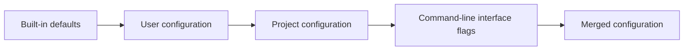

# Configuration Cascade

Sandbox reads configuration from four layers. Each layer can extend or override an earlier layer.

## Configuration Layers



The command-line interface (CLI) flags apply to one command only.

### 1. Built-in defaults

Sandbox provides defaults for settings such as `readonly`, `full_network`, `allow_network`, `allow_host_commands`, and `persist_paths`.

### 2. User configuration

`~/.config/sandbox/config.toml` applies to all projects.

### 3. Project configuration

`.sandbox/config.toml` contains project-specific settings.

### 4. CLI flags

Use flags such as `--mount`, `--env`, and `--allow-network` for one command.

## Merge Rules

### Arrays accumulate

Sandbox combines arrays from all layers.

```toml
# User configuration
allow_network = ["api.mycompany.com"]

# Project configuration
allow_network = ["database.mycompany.com:5432"]

# Merged result
allow_network = [
  # Built-in defaults remain here.
  "api.mycompany.com",
  "database.mycompany.com:5432",
]
```

A later layer can add array items. It cannot remove array items from an earlier layer.

The same rule applies to `allow_host_commands`. User and project rules form one effective host-command allowlist:

```toml
# User configuration
[[allow_host_commands]]
pattern = ["git", ["status", "diff", "log"]]

# Project configuration
[[allow_host_commands]]
pattern = ["bun", "run", "test:e2e"]
```

Sandbox appends trusted project rules after user rules. It removes structurally equal patterns and keeps the first rule. Rule tests run before duplicate removal. Project rules take effect only after the normal project trust check.

`sandbox escape --list` returns the effective patterns from the active session configuration. It prints compact JSON without rule tests or a heading:

```text
["git",["status","diff","log"]]
["bun","run","test:e2e"]
```

### Single-value settings override earlier values

The last specified value applies.

```toml
# User configuration
readonly = false

# Project configuration
readonly = true

# Merged result
readonly = true
```

Run `sandbox config` to inspect the merged configuration.

## Session Environment

`env` and `-e, --env` apply to each Sandbox shell or command and its child processes. They do not apply to container entrypoints or startup services. `sandbox container start` starts no session, so it warns when configured `env` values are present and does not apply them.

Sandbox resolves host passthrough values and variable expansion once per CLI invocation. Unset host passthrough values are skipped. Empty values and values that contain `=` are preserved.

For each variable, the last assignment in user, project, and CLI order wins. Available automatic terminal values then override user values. Managed proxy, host command escape, and debug values have the highest priority. Sandbox sends one final assignment per name. An omitted name does not remove an image-provided default.

These names are reserved for Sandbox and cause a configuration error:

- `SANDBOX` and all names with the `SANDBOX_` prefix
- `CLAUDE_CODE_SSE_PORT`
- `DISPLAY` and `X11_AVAILABLE`

Changes to session values do not rebuild images or prevent container reuse. Generated startup values, mounts, images, and the host-selected IDE bridge port still affect container identity. Existing containers can require replacement after this update through the normal reuse checks.

A new process receives values from its own invocation. Existing processes keep their values. Shared servers such as tmux do not receive a new environment automatically. Direct `docker exec` or `podman exec` commands do not receive Sandbox session values.

Sessions share a container and filesystem. Different environment values do not isolate sessions. Secrets passed at session execution can still be accessible to other container processes.

## Configuration Reference

See the [default user configuration](../templates/config.toml) and [project configuration](../templates/project-config.toml).

## Limitations

- Arrays cannot remove built-in items.
- Configuration cannot contain platform conditions.
- Sandbox does not recursively merge nested values.

## See Also

- [Architecture](./ARCHITECTURE.md)
- [Mounts](./MOUNTS.md)
- [Persistence](./PERSISTENCE.md)
- [Network Firewall](./NETWORK-FIREWALL.md)
