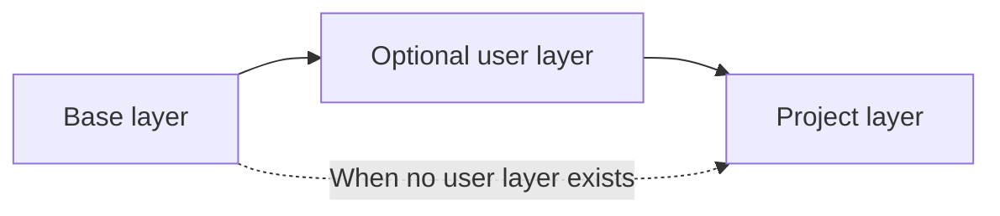
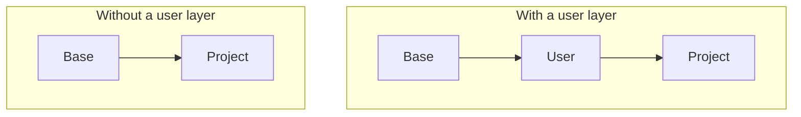

# Layered Docker Images

Sandbox separates container tools into three image layers. Each layer has a different configuration scope.

## Image Model



### Base layer

The base layer provides the operating system and common development tools. Sandbox maintains this layer.

It includes shells, source-control tools, runtime installation tools, build tools, network tools, and clipboard tools.

The base image provides system Node and small Sandbox launchers. The Sandbox CLI, container tools, and support files are delivered separately at container startup.

### Runtime package

The package build prepares the runtime under `dist/runtime/`, outside all image build contexts. The host copies it into the Sandbox data directory and mounts the cached directory read-only at `/opt/sandbox-cli`. The container runtime does not need access to the host npm installation directory.

Each cache directory uses the full package version and a content hash, such as `1.70.0-<sha256>`. Runtime-only changes do not rebuild the base, user, or project images. Development edits work without a package version change. New sessions select a container with the matching runtime identity. Active sessions retain their old runtime files.

Sandbox runtime commands are available after startup through Sandbox, not during Dockerfile `RUN` steps or a direct container-runtime command without the runtime cache mount. Dockerfiles must install tools without invoking the Sandbox CLI or container tools.

After a session ends, scheduled cleanup removes old cache directories that no container references. Cleanup runs at most once per day and always retains the current runtime. `sandbox clean` applies the same policy immediately. System package and launcher changes still require image rebuilds.

### User layer

The user layer provides tools for all projects. Configure it in `~/.config/sandbox/docker/Dockerfile`.

Use this layer for personal tools and common runtimes.

### Project layer

The project layer provides tools for one project. Configure it in `.sandbox/docker/Dockerfile`.

Use this layer for project-specific runtimes, system packages, and build dependencies.

## Layer Selection

A project uses the base layer directly when no user layer exists. Otherwise, the project layer extends the user layer.



This model keeps project tools separate. A project-specific tool does not change another project image.

## Rebuild Model

Sandbox tracks the content of each layer. It rebuilds a layer when its build content or parent layer changes.

| Change | Rebuilt layers |
| --- | --- |
| Runtime package only | None. Prepare a host runtime cache instead |
| Base layer | Base, user, and project |
| User layer | User and project |
| Project layer | Project only |

Normal builds use the container runtime cache. Upgrade commands request fresh package installation.

Sandbox adds the `sandbox.managed=true` label to each image that it builds. Cleanup finds historical images by this label. It removes a candidate only when the image is untagged and no container uses it. Cleanup stops if a runtime check fails. It does not run a global image prune.

Build secrets use the container runtime secret transport. Sandbox does not put secret values in build arguments or command logs.

## Build Commands

```bash
sandbox build                 # Rebuild changed layers
sandbox build --user          # Rebuild from the user layer
sandbox build --project       # Rebuild the project layer
sandbox upgrade               # Rebuild all layers without cached package steps
sandbox upgrade --user        # Upgrade user and project layers
sandbox upgrade --project     # Upgrade the project layer
```

A targeted build checks parent layers first. Sandbox rebuilds a changed parent before it builds the selected layer.

## Design Trade-Offs

Layering reduces repeated work and separates configuration scopes. It also creates parent-child dependencies.

- A base-layer change affects all images.
- A user-layer change affects all project images.
- Every project inherits the user layer when it exists.
- A project cannot select a different base or disable the user layer.

## See Also

- [Architecture](./ARCHITECTURE.md)
- [Configuration Cascade](./CONFIG-CASCADE.md)
