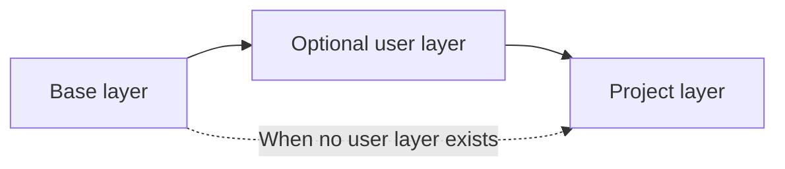
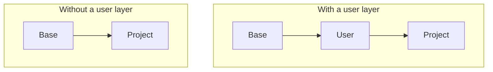

# Layered Docker Images

Sandbox separates container tools into three image layers. Each layer has a different configuration scope.

## Image Model



### Base layer

The base layer provides the operating system and common development tools. Sandbox maintains this layer.

It includes shells, source-control tools, runtime installation tools, build tools, network tools, and clipboard tools.

The image also owns the Sandbox CLI, container tools, and support files at `/opt/sandbox-cli`. The package build prepares these files in the Docker build context. The container runtime receives them during the image build, so the host npm installation directory does not need to be shared with its VM. Container startup does not mount that directory.

Runtime package changes are part of the base-layer content hash. They trigger a rebuild of the base layer and its dependent layers. Existing running containers keep their image-owned runtime files until they stop.

### User layer

The user layer provides tools for all projects. Configure it in `~/.config/sandbox/docker/Dockerfile`.

Use this layer for personal tools and common runtimes.

### Project layer

The project layer provides tools for one project. Configure it in `.sandbox/docker/Dockerfile`.

Use this layer for project-specific runtimes, system packages, and build dependencies.

## Layer Selection

A project uses the base layer directly when no user layer exists. Otherwise, the project layer extends the user layer.



This model keeps project tools separate. A project-specific tool does not change another project image.

## Rebuild Model

Sandbox tracks the content of each layer. It rebuilds a layer when its build content or parent layer changes.

| Change | Rebuilt layers |
| --- | --- |
| Base layer | Base, user, and project |
| User layer | User and project |
| Project layer | Project only |

Normal builds use the container runtime cache. Upgrade commands request fresh package installation.

## Build Commands

```bash
sandbox build                 # Rebuild changed layers
sandbox build --user          # Rebuild from the user layer
sandbox build --project       # Rebuild the project layer
sandbox upgrade               # Rebuild all layers without cached package steps
sandbox upgrade --user        # Upgrade user and project layers
sandbox upgrade --project     # Upgrade the project layer
```

A targeted build checks parent layers first. Sandbox rebuilds a changed parent before it builds the selected layer.

## Design Trade-Offs

Layering reduces repeated work and separates configuration scopes. It also creates parent-child dependencies.

- A base-layer change affects all images.
- A user-layer change affects all project images.
- Every project inherits the user layer when it exists.
- A project cannot select a different base or disable the user layer.

## See Also

- [Architecture](./ARCHITECTURE.md)
- [Configuration Cascade](./CONFIG-CASCADE.md)
