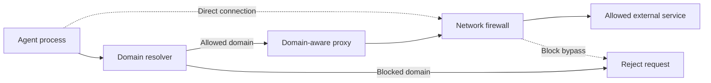

# Network Firewall

Sandbox restricts outbound container traffic to an allowlist of domains. This reduces the risk that an agent sends project data to an unauthorized service.

## Security Boundary

The firewall controls external network access from the container. It does not control communication with mounted files or allowed services.

An allowed domain can receive data from the agent. Keep the allowlist small. Avoid wildcard domains unless they are required.

## Network Model

The network system uses three layers:

1. Domain resolution rejects domains outside the allowlist.
2. A domain-aware proxy routes supported outbound traffic.
3. IPv4 and IPv6 firewalls block direct outbound connections.

The agent user cannot change the network policy after container startup.



This design keeps domain checks in the request path. It also blocks applications that try to connect directly to an external address.

The IPv6 firewall permits only address configuration messages, established traffic, and required resolver traffic in restricted mode. Only the dnsmasq user can contact a selected IPv6 resolver. The rule restricts the destination address, guest interface, port 53, and TCP or User Datagram Protocol (UDP). Other direct IPv6 Domain Name System (DNS) and external traffic is blocked.

## Supported Traffic

Hypertext Transfer Protocol (HTTP), secure HTTP (HTTPS), Secure Shell (SSH), and Git over SSH use the proxy path.

Another protocol must support tunneling through the proxy. A direct custom protocol might not work in restricted mode.

Container-local services remain available. Restricted mode does not permit direct access to private Internet Protocol (IP) ranges.

Exact runtime host aliases resolve to the reachable host gateway. The aliases do not permit gateway ports. For a normal session, Sandbox temporarily permits only the authenticated host-command broker port for the agent user. Sandbox removes this rule when the session ends. Sandbox does not create wildcard host aliases.

## Configure the Allowlist

Add required domains to `allow_network`:

```toml
allow_network = [
  "api.example.com",
  "db.example.com:5432",
  "git.example.com:{22,443}",
  "*.example.net:443",
  "service.example.org:*",
  "*.internal.example.org:{*}",
]
```

Ports 80 and 443 apply when an entry does not specify a port.

Proxy requests that use a literal IPv4 address require an explicit entry in the same allowlist, such as `"192.0.2.10:443"`. A reverse DNS match to an allowed domain does not permit the request. Use the allowed hostname when possible.

Use `host:*` or `host:{*}` to allow all Transmission Control Protocol (TCP) ports for one host. The traffic must still use the managed proxy.

A wildcard such as `*.example.net` matches the base domain and all subdomains. Wildcards increase the available network surface.

Allowlist entries accumulate across configuration layers. See [Configuration Cascade](./CONFIG-CASCADE.md).

## Full-Network Mode

Use full-network mode when the task requires unrestricted outbound access:

```bash
sandbox --full-network
```

Full-network mode disables domain filtering. Network traffic still uses the managed network path and remains visible in network logs.

Use this mode only for trusted code.

## Network Logs

Show blocked requests:

```bash
sandbox network logs
```

Show allowed and blocked requests:

```bash
sandbox network logs --status=all
```

Capture detailed diagnostic data while the affected container is running:

```bash
sandbox network logs --raw > sandbox-network-debug.log
```

Use the logs to identify a missing domain. Add only the domains that the task requires.

Network logs can omit repeated high-volume blocked traffic. A reported hostname can also differ from the requested hostname when several domains use one Internet Protocol (IP) address.

## Remaining Risks

The firewall does not prevent:

- data transfer to an allowed domain
- data in subdomain names under an allowed wildcard domain
- access to permitted private network services
- attacks that break the container or runtime security boundary

The firewall reduces available network access. It does not prove that an allowed service is safe.

## See Also

- [Architecture](./ARCHITECTURE.md)
- [Configuration Cascade](./CONFIG-CASCADE.md)
